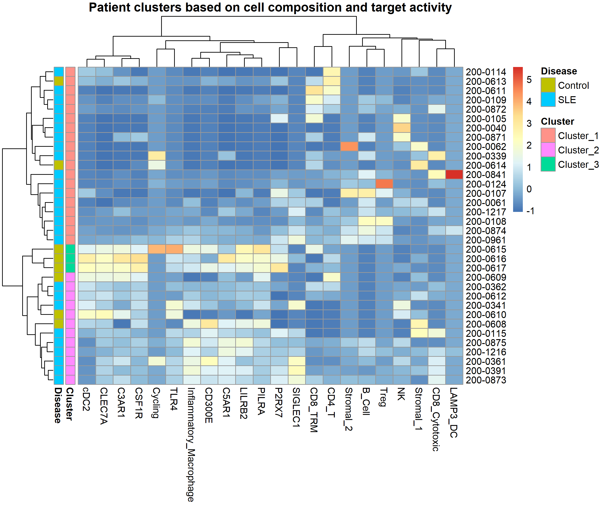
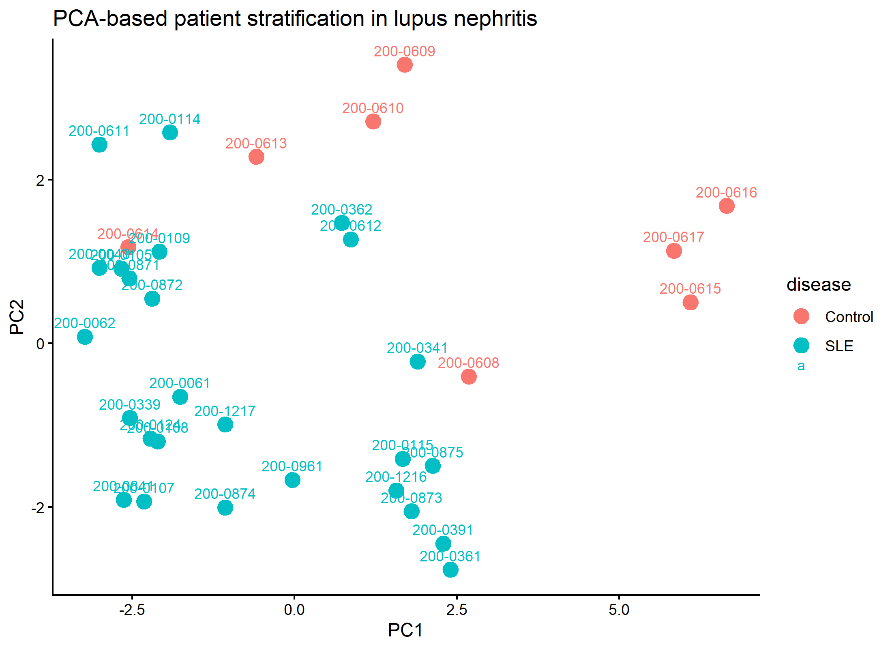
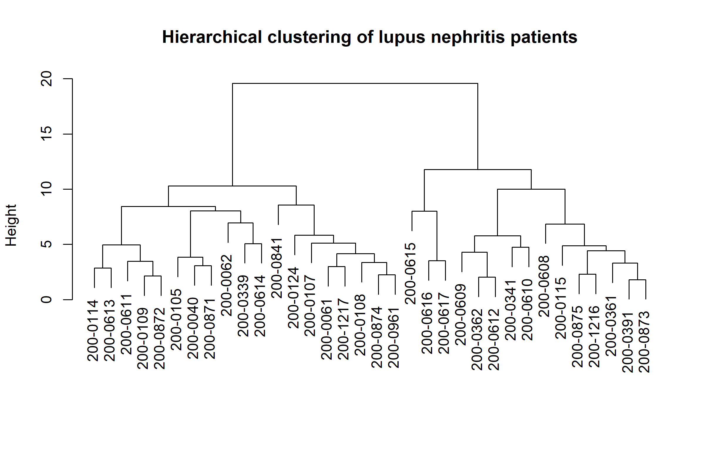
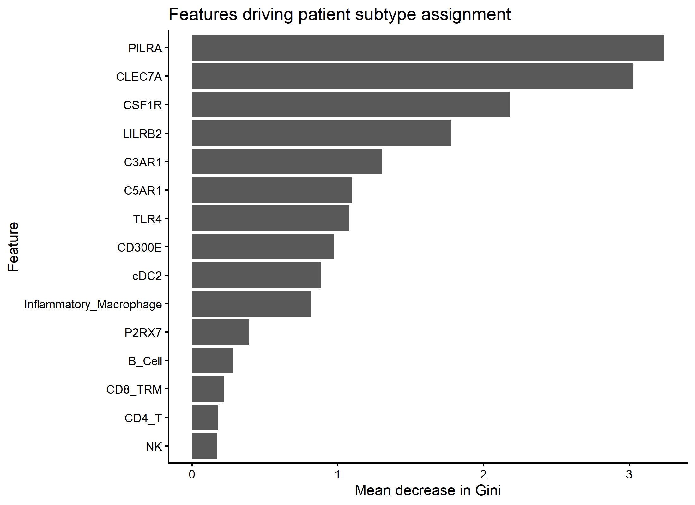
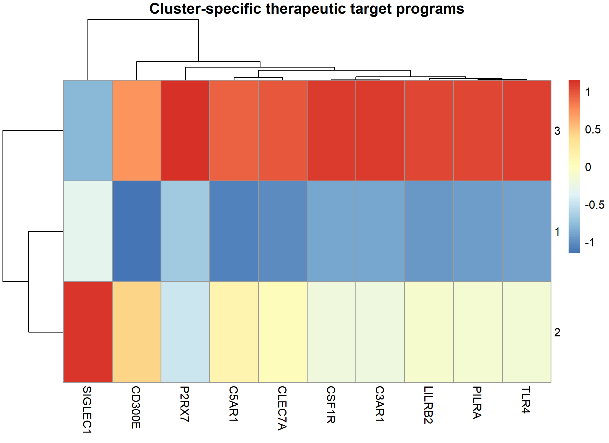

<p align="center">
  
</p>

<h1 align="center">
AI-Driven Patient Stratification and Precision Targeting in Lupus Nephritis
</h1>

<p align="center">


</p>

---

# Overview

This project presents an end-to-end AI-driven computational pipeline for identifying biologically distinct patient subtypes in lupus nephritis using single-cell RNA sequencing data.

Instead of analyzing individual immune cells in isolation, the workflow reconstructs **patient-level molecular profiles**, applies **unsupervised machine learning**, identifies disease-driving biological programs, and prioritizes therapeutic targets for each patient subtype.

The overall objective is to demonstrate how computational biology and machine learning can support **precision medicine** and **target discovery** in autoimmune diseases.

---

# Scientific Motivation

Lupus nephritis exhibits remarkable molecular heterogeneity.

Patients with similar clinical diagnoses often have very different immune programs and therefore may respond differently to therapy.

This project addresses this challenge by integrating:

- immune cell composition
- therapeutic target expression
- machine learning
- patient stratification
- precision therapeutic hypothesis generation

into a single reproducible workflow.

---

# Workflow

```text
Single-cell RNA sequencing
             │
             ▼
Quality-controlled Seurat object
             │
             ▼
Patient-level Feature Matrix
(Cell composition + Target expression)
             │
             ▼
Principal Component Analysis
             │
             ▼
Hierarchical Clustering
             │
             ▼
Random Forest
Feature Importance
             │
             ▼
Cluster-specific Target Programs
             │
             ▼
Precision Therapeutic Recommendations
```

---

# Repository Structure

```
scripts/
│
├── 01_build_patient_feature_matrix.R
├── 02_patient_stratification.R
├── 03_ml_feature_importance.R
└── 04_therapeutic_recommendation_engine.R

figures/

results/

docs/

data/
    README.md
```

---

# Dataset

Human kidney single-cell RNA sequencing

**AMP Lupus Nephritis Consortium**

ImmPort Study:

**SDY997**

The processed Seurat object is intentionally excluded because of GitHub size limitations.

Instructions for downloading the original data are provided inside the **data/** folder.

---

# AI & Machine Learning Pipeline

The project implements multiple computational approaches:

- Patient-level feature engineering
- Principal Component Analysis (PCA)
- Hierarchical clustering
- Random Forest classification
- Feature importance ranking
- Cluster-specific target prioritization

Unlike traditional differential expression analyses, this workflow focuses on identifying **patient subtypes** rather than individual marker genes.

---

# Main Results

The pipeline generates:

- Patient immune composition matrix
- Patient molecular feature matrix
- PCA visualization
- Hierarchical clustering
- Patient subtype heatmap
- Machine learning feature importance
- Cluster-specific therapeutic target programs
- Precision therapeutic hypotheses

---

# Key Machine Learning Findings

Random Forest identified the strongest biological drivers of patient subtype separation:

| Rank | Feature |
|------|----------|
| 1 | PILRA |
| 2 | CLEC7A |
| 3 | CSF1R |
| 4 | LILRB2 |
| 5 | C3AR1 |
| 6 | C5AR1 |
| 7 | TLR4 |
| 8 | CD300E |

These findings indicate that **myeloid activation**, **complement signaling**, and **innate immune programs** are major contributors to patient heterogeneity.

---

# Precision Therapeutic Hypotheses

| Patient Cluster | Dominant Biology | Candidate Targets |
|-----------------|-----------------|-------------------|
| Cluster 1 | Mild innate immune activation | CSF1R • P2RX7 • C3AR1 |
| Cluster 2 | Complement-driven macrophage activation | CSF1R • CLEC7A • C5AR1 |
| Cluster 3 | Highly activated inflammatory macrophages | CSF1R • C3AR1 • LILRB2 |

---

# Example Figures

## Patient Stratification

<p align="center">


</p>

---

## Machine Learning

<p align="center">

</p>

---

## Therapeutic Programs

<p align="center">

</p>

---

# Technologies

- R
- Seurat
- dplyr
- tidyr
- ggplot2
- pheatmap
- Random Forest
- Single-cell RNA sequencing
- Machine Learning
- Computational Immunology
- Precision Medicine

---

# Future Directions

Planned extensions include:

- UMAP-based patient visualization
- XGBoost-based patient classification
- SHAP-based model interpretation
- Graph Neural Networks for patient similarity
- Multi-omic integration (scRNA-seq + spatial transcriptomics)
- External validation using independent lupus nephritis cohorts
- Drug repurposing prediction
- Clinical outcome prediction

---

# Reproducibility

The analysis is fully reproducible.

Run the scripts in order:

```
01_build_patient_feature_matrix.R

↓

02_patient_stratification.R

↓

03_ml_feature_importance.R

↓

04_therapeutic_recommendation_engine.R
```

All intermediate results and publication-quality figures are generated automatically.

---

# Related Projects

This repository is part of a larger AI-driven computational immunology portfolio:

- Lupus Nephritis Target Discovery Atlas
- Cell–Cell Communication Analysis
- AI-Driven Therapeutic Target Prioritization
- AI-Driven Patient Stratification and Precision Targeting

Together these projects demonstrate an end-to-end workflow from **single-cell biology** to **precision therapeutic target discovery**.

---

# Author

Independent computational biology and AI project focused on:

- Translational Immunology
- Autoimmune Disease
- Machine Learning
- Precision Medicine
- Therapeutic Target Discovery
